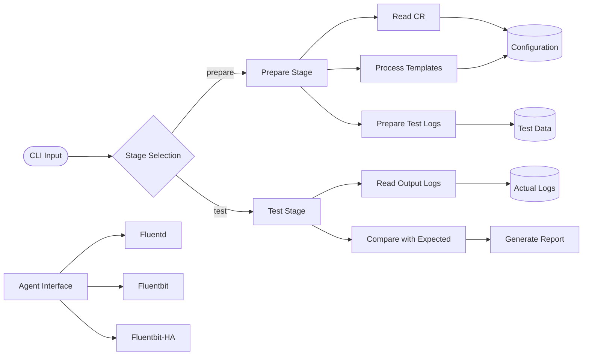

# Qubership Fluent Pipeline Tests

[](https://github.com/Netcracker/qubership-fluent-pipeline-tests/actions/workflows/build.yaml)
[](https://github.com/Netcracker/qubership-fluent-pipeline-tests/pkgs/container/qubership-fluent-pipeline-tests)
[](https://github.com/Netcracker/qubership-fluent-pipeline-tests/releases)

Integration testing framework for Fluent logging pipeline configurations, supporting validation of Fluentd, Fluentbit, and Fluentbit-HA agent deployments.

## Features

* Support for multiple Fluent logging agents: Fluentd, Fluentbit, and Fluentbit-HA
* Two-stage testing pipeline: configuration preparation and log comparison
* Kubernetes LoggingService custom resource integration
* Docker containerized execution with shared volume support
* Comprehensive log validation with detailed reporting
* Multi-platform container builds (linux/amd64, linux/arm64)

## Requirements

* Unix/Linux shell (VM with Linux, WSL)
* Docker
* Go 1.24.0+ (for local development)
* Kubernetes cluster (for LoggingService resources)
* LoggingService custom resource files (examples can be created based on project needs)

## Installation

### Using Docker (Recommended)

```bash
docker pull ghcr.io/netcracker/qubership-fluent-pipeline-tests:latest
```

> **Note:** If you're using a fork, the image path may differ based on your GitHub organization/username.

### From Source

```bash
git clone https://github.com/Netcracker/qubership-fluent-pipeline-tests.git
cd qubership-fluent-pipeline-tests

# Simple build
go build -o fluent-test main.go

# Production build (consistent with Dockerfile)
CGO_ENABLED=0 go build -a -o fluent-test main.go
```

## Usage

The application supports two main stages: `prepare` and `test` (default).

### Preparation Stage

```bash
# Docker
docker run --rm -v /path/to/config:/config-templates.d \
  -v /path/to/output:/configuration.d \
  -v /path/to/logs:/logs \
  -v /path/to/testdata:/testdata \
  ghcr.io/netcracker/qubership-fluent-pipeline-tests:latest \
  -stage=prepare -agent=fluentbit -cr=/assets/logging-service-test-fluentbit.yaml

# Local binary
./fluent-test -stage=prepare -agent=fluentbit -cr=/path/to/custom-resource.yaml
```

### Testing Stage

```bash
# Docker
docker run --rm -v /path/to/output-logs:/output-logs \
  ghcr.io/netcracker/qubership-fluent-pipeline-tests:latest \
  -stage=test -agent=fluentbit

# Local binary  
./fluent-test -stage=test -agent=fluentbit -ignore="file1.log.json,file2.log.json"
```

Integration tests for all 3 agent deployments can be run manually using Docker commands.
Test scenarios available:

* `fluentd`
* `fluentbit`
* `fluentbit-ha`

## Configuration

### Command-line Options

| Option | Default | Description |
|--------|---------|-------------|
| `-stage` | `test` | Stage of pipeline testing (`prepare`, `test`) |
| `-agent` | `fluentbit` | Logging agent type (`fluentbit`, `fluentbitha`, `fluentd`) |
| `-cr` | `/assets/logging-service-test-fluentbit.yaml` | Path to LoggingService custom resource |
| `-ignore` | `""` | Comma-separated list of files to ignore during tests |
| `-ignoreFluentdTime` | `audit.log.json,kubernetes.audit.log.json,varlogsyslog.log.json` | Files to ignore fluentd_time parameter |
| `-loglevel` | `info` | Application log level |

> **Note:** The default custom resource path `/assets/logging-service-test-fluentbit.yaml` is configured for containerized execution. For local development, provide your own LoggingService custom resource file path using the `-cr` parameter.

### Volume Mounts

| Path | Purpose |
|------|---------|
| `/config-templates.d` | Input configuration templates |
| `/configuration.d` | Output processed configurations |
| `/logs` | Input log files for testing |
| `/testdata` | Prepared test data output |
| `/output-logs` | Actual vs expected log comparison |

## API Reference

### Command Line Interface

The application provides a simple CLI interface with two main stages:

#### Prepare Stage

* Reads LoggingService custom resource
* Processes configuration templates from `/config-templates.d`
* Outputs processed configurations to `/configuration.d`
* Prepares test log data in `/testdata`

#### Test Stage

* Reads actual logs from `/output-logs/actual/`
* Compares against expected logs in `/output-logs/expected/`
* Generates detailed validation reports
* Supports file filtering and Fluentd time parameter handling

For detailed parameter descriptions, see [Configuration](#configuration) section.

## Architecture

### System Overview



The application follows a two-stage architecture:

1. **Preparation Stage**: Processes Kubernetes LoggingService custom resources, fills configuration templates, and prepares test log data
2. **Testing Stage**: Compares actual Fluent output logs against expected results, generating detailed validation reports

## Testing

### Problems during local run

#### Tests failed due the `\r` at the end

This issue can occurs due work on `Windows`, but run tests in `WSL2`, for example in `Ubuntu 24.04`.
Also, most probably you configured in `Git` work with line ends in `Windows-style`, but commit `in Unix-style`.

You can manually convert line end in any IDE/editors (VSC, Notepad++, etc.).

Or use the CLI tool:

```bash
apt install dos2unix
find fluent-pipeline-test/ -type f -exec dos2unix {} \;
```

## Contributing

Please see our [Contributing Guide](CONTRIBUTING.md) for details on how to contribute to this project.

## Security

For security issues, please see our [Security Policy](SECURITY.md).

## Code of Conduct

This project follows our [Code of Conduct](CODE-OF-CONDUCT.md). By participating, you are expected to uphold this code.

## License

This project is licensed under the Apache License 2.0 - see the [LICENSE](LICENSE) file for details.
